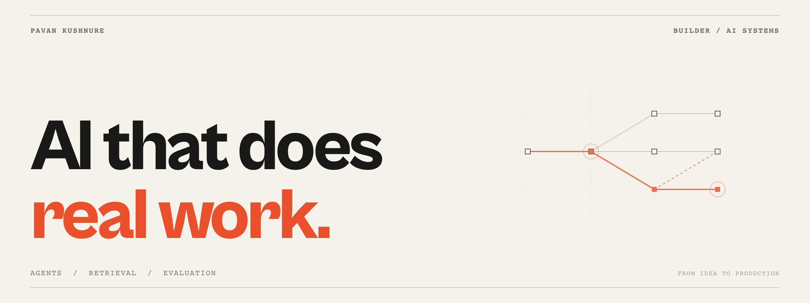

# Hey, I'm Pavan.

**Lead AI Engineer @ [BraventLLC](https://github.com/BraventLLC)**

I build agent frameworks, RAG pipelines, and the evaluation systems that tell us whether they're actually working.
My work runs from retrieval and model orchestration through the backend, product UI, and cloud deployment.

[Portfolio](https://pavankushnure.website) · [X](https://x.com/pavankushnure) · [Email](mailto:pavankushnure2000@gmail.com) · [Instagram](https://instagram.com/pavankushnure)

## What I've built at Bravent

Most of my day-to-day engineering lives in company repositories.
Here's the work behind the green squares.

### [GovEngine](https://govengine.ai) · Agent frameworks & orchestration

Agent builders and execution workflows that turn a plain-English request into an inspectable graph, with approvals, tool integrations, and manual, scheduled, or event-triggered runs.
My work also includes cloud inventory, utilization, and cost monitoring across AWS, Azure, and GCP.

### [ProposalIQ](https://proposaliq.govcom.ai) · Production RAG & evaluation

Hybrid retrieval over proposal documents, combining semantic search with exact-term matching and source-cited drafting.
I worked on agentic opportunity sourcing through MCP integrations and built model-comparison evals with weighted rubrics for writing quality, completeness, and accuracy.

### [MCPOne](https://mcpone.ai) · AI governance & runtime infrastructure

Policy-enforced model calls, runtime guardrails, and audit trails, with REST, gRPC, and MCP integrations.
My work spans the infrastructure that connects applications to models and tools while keeping their behavior observable and governed.

### [Braible](https://braible.ai) · AI-powered web experiences

AI-assisted live restyling, a visual page configurator, embeddable chat experiences, and semantic site search backed by hybrid RAG.
I work across the AI features and the interfaces people use to configure, preview, and publish them.

### [GovHub](https://govhub.ai) · Agent-powered knowledge platform

I also worked on a knowledge hub for federal AI policy, guidance, and contract opportunities, with agents keeping information current.

## The engineering I care about

- **Agents that can finish the job:** tool use, orchestration, approvals, background jobs, and useful failure handling.
- **Retrieval you can inspect:** hybrid search, document processing, citations, and grounded outputs.
- **Evals before opinions:** model comparisons, rubric scoring, golden datasets, and regression checks when prompts or models change.
- **Owning the delivery:** APIs, product interfaces, observability, CI/CD, and cloud deployment.

**Daily tools:** Python · TypeScript · React / Next.js · Node.js · FastAPI · PostgreSQL · Qdrant · Redis · Docker · MCP

## Things you can open, run, and break

| Project | What I built |
| :--- | :--- |
| [Doc Extractor](https://github.com/Scylla23/doc-extractor) | Invoice PDFs to validated JSON, with confidence scores, page citations, and an evaluation suite. [Try it →](https://doc-extractor-five.vercel.app) |
| [FeatureGate](https://github.com/Scylla23/featuregate) | Self-hosted feature flags with targeting rules, segments, and percentage rollouts. |
| [ModelRouter](https://github.com/Scylla23/modelrouter) | A Claude Code plugin for choosing models by task, with visible routing decisions and escalation. |
| [ModelDuet](https://github.com/Scylla23/modelduet) | A skill that pairs planning and review with a separate implementation model in a bounded loop. |

## Building something ambitious?

If you're hiring an engineer to own an AI product from the model layer to the shipped experience, [send me what you're building](mailto:pavankushnure2000@gmail.com).
If you're a developer poking around, try a repo and tell me what breaks.

[Find me on X](https://x.com/pavankushnure) · [Say hi on Instagram](https://instagram.com/pavankushnure) · [More of my work](https://pavankushnure.website)
